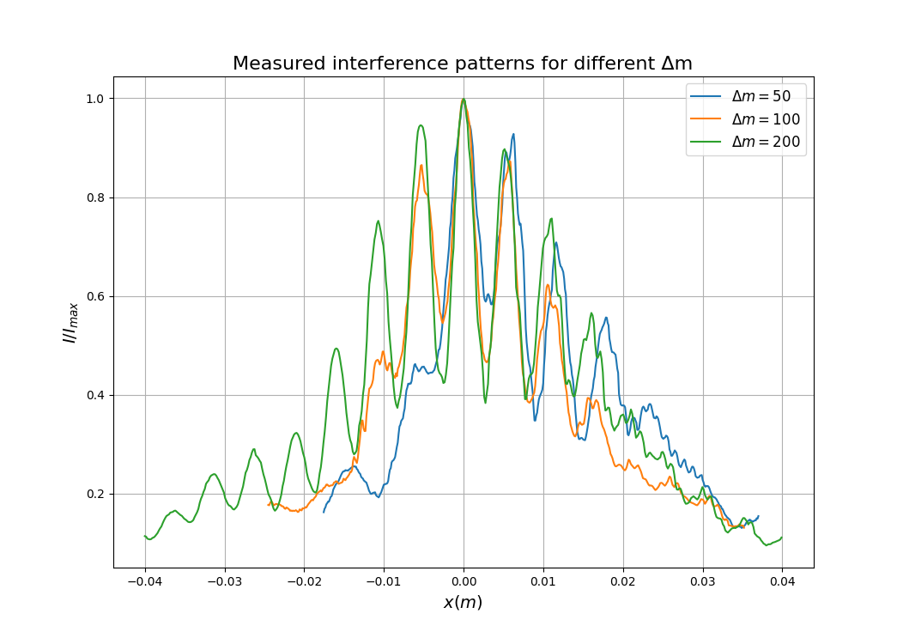
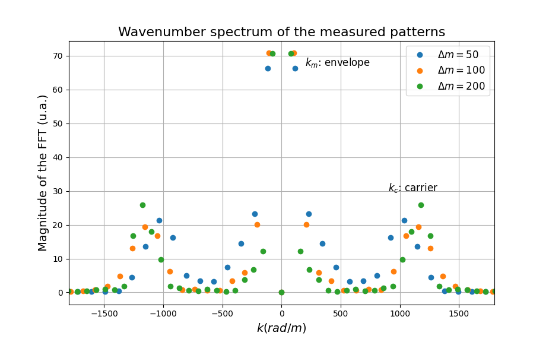
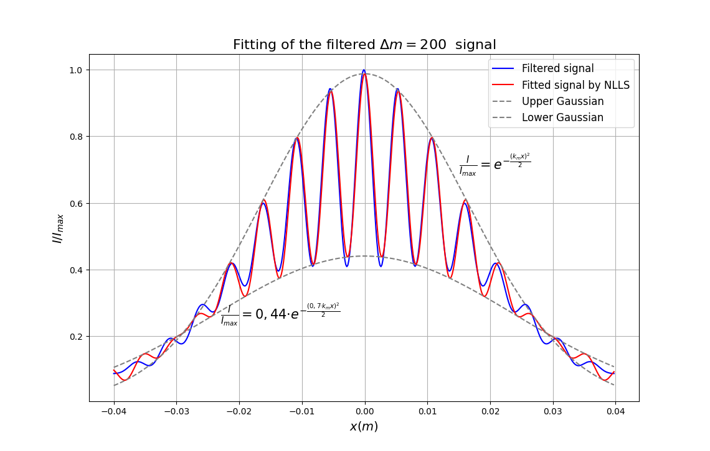
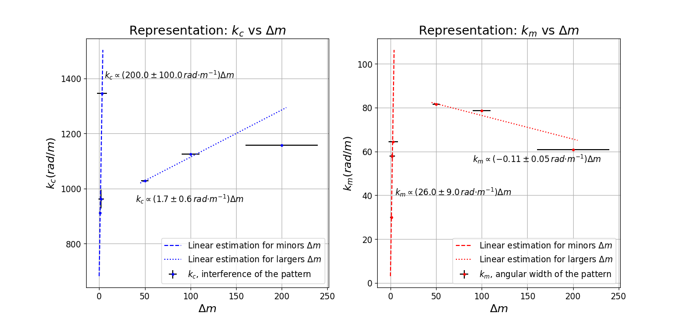

# LASER CALCULATOR: Manipulating Wavenumber in Linear Media

This project implements the experimental and computational analysis of the **LASER CALCULATOR** experiment, developed as part of *Experimental Techniques III* (Physics Degree, University of Oviedo). The goal is to explore how algebraic operations between waves can be implemented using linear optics and signal processing in the Fourier plane.

---


[]()
[]()
[]()

---

## 🔍 **Abstract**

This repository contains code and data associated with an experimental study on implementing algebraic operations between waves using linear optical systems. Data from an interferometric setup are processed through FFT-based filtering and nonlinear least squares fitting to parametrize wave number modifications via Fourier-plane manipulation. The workflow demonstrates how wave products can be mapped onto controllable optical signal patterns, providing a foundation for analog optical computation.

---

## 🎯 **Scientific Objective**
- Implement basic operations between waves (addition, subtraction, scalar multiplication) using linear media.
- Analyze how manipulation in the Fourier plane allows modification of the wavenumber.
- Fit interference patterns using digital signal processing and nonlinear models.

This work lays the foundation for future developments in **Fourier optics** and **scientific data analysis**, specifically seeking to parameterize basic algebraic operations through linear optics.

---

## 📄 **Proyect presentation**

[See complete poster](docs/POSTER_Laser-Calculator.pdf)

---

## 📂 **Project Structure**
laser-calculator/  
│  
├── data/  
│   └── dataset_laser.csv             # Experimental data    
│  
├── docs/   
│   └── POSTER_Laser-Calculator       # Proyect presentation  
│   └── Graph2_MeasuredPatterns       # Graph 2 of the poster  
│   └── Graph3_WavenumberSpectrum     # Graph 3 of the poster   
│   └── Graph4_FittedFilteredSignals  # Graph 4 of the poster   
│   └── Graph5_PatternTrends          # Graph 5 of the poster    
│  
├── src/  
│   ├── data_loader.py                # Data loading and filtering  
│   ├── preprocessing.py              # Normalization and interpolation  
│   ├── signal_processing.py          # FFT, band-pass filtering, NLLS fitting  
│   ├── parameter_analysis.py         # Linear estimations and final results  
│   ├── visualization.py              # Plotting utilities  
│   └── main.py                       # Main script  
│  
├── README.md  
└── LICENSE  
└── .gitignore  
└── requirements.txt  

---

## 🚀 **How to Run**


*Requirements*
- Python 3.10 or higher
- Install dependencies:
```bash
# 1. Clone the repository:
git clone https://github.com/yourusername/laser-calculator.git
cd laser-calculator

# 2. Install dependencies:
pip install -r requirements.txt

# 3. Run the main script:
python src/main.py
```

---

## 🔍 **Analysis workflow**

- Data Loading from dataset_laser.csv.
- Preprocessing: normalization and interpolation.
- Signal Processing:
    - FFT to estimate dominant frequencies.
    - Double band-pass filtering.
    - Nonlinear Least Squares (NLLS) fitting with a modulated cosine model.
- Final Analysis:
    - Linear estimations (ODR) for parameter relationships.
    - Comparative visualization.

---

## 📊 **Example Outputs**

- Preprocessed interference pattern

- FFT spectrum highlighting dominant wavenumbers.

- Filtered interference pattern with NLLS fit.

- Comparative plots of linear estimations.


---

## 🛠 **Technologies**

- Python 3.x
- NumPy, SciPy, Pandas, Matplotlib

---

## 📌 **Next Steps**

- Keep working in this experiment in order to establish a complete
  analytical parameterization of wave product.
- Study the possibility of parameterizing more complex algebraic operations 
- Explore other applications of Fourier optics in advanced signal processing.

---

## 📬 **Connect with me**

- https://www.linkedin.com/in/santiago-garc%C3%ADa-rodr%C3%ADguez-b8aa58240/
- https://github.com/SantiagoGR11
